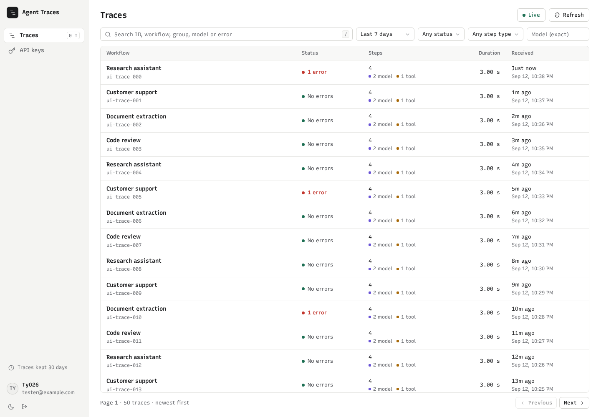

# Agent Traces

A self-hosted agent tracing collector and viewer. Rust serves an English Svelte interface and APIs from one process; SQLite stores everything on a local disk. No Node.js runtime or external database is required in production.

Inspect agent runs with a virtualized execution tree and waterfall, structured model messages and tool calls, lazy payload loading, trace-local content search, deep links, JSON export, keyboard navigation and light/dark themes. New data appears as an update prompt so the current inspection stays in place.

## Run locally

Requirements: Rust 1.88+ (validated with 1.98), Node.js 24+ for building the UI, a C compiler for bundled SQLite.

```bash
cp .env.example .env
npm --prefix web ci
npm --prefix web run build
cargo run --release
```

Open http://localhost:3000. Configure GitHub OAuth before signing in. An unconfigured service shows a setup message and denies workspace access; there is no default account or authentication bypass.

For frontend development, run the backend with `BIND_ADDR=127.0.0.1:3001 cargo run` and `npm --prefix web run dev` in another terminal. Keep `PUBLIC_BASE_URL=http://localhost:3000`. Vite proxies API/auth/ingest calls to Rust.

## GitHub login

Register a GitHub OAuth App in **Settings → Developer settings → OAuth Apps**. Set the homepage to your external origin, and the authorization callback to:

```text
https://traces.example.com/auth/github/callback
```

For local development, use `http://localhost:3000/auth/github/callback`. Set these variables in `.env` or your deployment secrets:

```dotenv
PUBLIC_BASE_URL=https://traces.example.com
GITHUB_CLIENT_ID=your-client-id
GITHUB_CLIENT_SECRET=your-client-secret
ALLOWED_EMAILS=alice@example.com,bob@example.com
```

The application requests `read:user user:email`, checks **verified** email addresses (including private addresses), and matches any exact allowlisted address case-insensitively. Empty allowlists deny access. All allowed users administer the same traces and keys. Browser sessions expire after seven days; removing an email from the environment and restarting invalidates its existing sessions. GitHub access tokens are used during login and are not persisted. Changes to verified emails on GitHub are checked at the next login.

Non-local public origins require HTTPS. Configure your reverse proxy for TLS and forward to the local service. Cookies are HttpOnly, SameSite=Lax and Secure for HTTPS. GitHub CLI login is independent of this application's OAuth credentials. GitHub's documented OAuth App registration uses its web settings.

## Docker Compose

```bash
cp .env.example .env
# Set OAuth values and PUBLIC_BASE_URL in .env.
docker compose up --build -d
```

Compose binds port 3000 to the host loopback address by default and uses a named volume for SQLite and backups. To use another host port, set both `TRACES_PORT=4180` and `PUBLIC_BASE_URL=http://localhost:4180` in `.env`. The `unless-stopped` restart policy restarts the service after failures and Docker daemon restarts; enable Docker at boot for persistent local operation. The container runs as UID 10001, with 2 CPU / 2 GiB limits and a 60-second shutdown grace period. Put an HTTPS reverse proxy in front for external access. For a bind mount, make the directory writable by UID 10001. Run exactly one instance against a database; an application lock rejects accidental duplicate instances. Use a local disk, not NFS/SMB.

## Send traces

Create a key on **API keys**. Full keys appear only once. The database stores SHA-256 digests of high-entropy random keys. Keys support names, optional expiration, last accepted usage and immediate revocation for future requests. Already queued records still commit after revocation. All keys are ingestion-only; they cannot read, export, delete, or manage data.

```bash
curl http://localhost:3000/v1/traces/ingest \
  -H "Authorization: Bearer $TRACE_API_KEY" \
  -H 'Content-Type: application/json' \
  -H 'OpenAI-Beta: traces=v1' \
  -d '{"data":[{"object":"trace","id":"trace_example","workflow_name":"Research assistant"}]}'
```

The endpoint retains the former OpenAI exporter-shaped envelope: up to 1,000 object records and 16 MiB per request. `trace` and `trace.span` preserve original JSON, upsert by globally unique ID, and accept spans before their trace. Unknown/malformed individual records increment `rejected`; malformed envelopes return 400. The `OpenAI-Beta` header remains optional. The optional `TRACE_INGEST_TOKEN` environment variable works alongside managed keys and is shown as environment-managed in the UI. Remove it and restart to revoke it.

A successful `200 {"accepted":N,"rejected":M}` means valid records entered the **in-memory queue**, not that they reached durable storage. Under ordinary load the writer flushes every 200 ms, with a target of under one second. The queue is limited by estimated memory (64 MiB default) and 256 batches; at most eight ingestion requests read/parse bodies concurrently; SQLite runs in WAL/NORMAL mode. A full queue or unavailable writer returns **503 with Retry-After: 2**; clients must retry with backoff. Failed batches remain in memory and are retried. Abrupt termination or power loss can lose any uncommitted backlog and, with NORMAL synchronization, recent commits on power loss. Normal shutdown drains; if storage remains broken beyond 45 seconds, the process reports the undrained count and exits with an error.

`GET /api/health` is public and returns 503 when the writer is failed or stopping. The authenticated workspace also reports writer backlog and maintenance failures. Logs contain service errors, not payloads or credentials.

## Configuration

| Variable | Default | Meaning |
| --- | --- | --- |
| `BIND_ADDR` | `127.0.0.1:3000` | HTTP listen address |
| `PUBLIC_BASE_URL` | `http://localhost:3000` | External origin used for OAuth and origin validation |
| `DATABASE_PATH` | `data/traces.sqlite3` | SQLite database path |
| `STATIC_DIR` | `web/build` | Exported frontend files |
| `BACKUP_DIR` | `data/backups` | Local consistent backups |
| `RETENTION_DAYS` | `30` | Expire whole traces after last receipt; `0` disables |
| `QUEUE_BYTES` | `67108864` | Estimated queue-memory budget, 1 KiB–1 GiB |
| `GITHUB_CLIENT_ID` / `GITHUB_CLIENT_SECRET` | empty | GitHub OAuth credentials |
| `ALLOWED_EMAILS` | empty | Comma-separated exact verified emails |
| `TRACE_INGEST_TOKEN` | empty | Optional legacy ingestion credential |
| `RUST_LOG` | `agent_traces=info` | Log filter |

## Retention, backup and restore

Hourly cleanup expires whole traces by **last receipt**, including late updates. SQLite reuses freed pages; file size does not automatically shrink. Capacity-plan for the actual average span size, ingest rate and retention window.

A consistent backup runs daily (or at startup when no recent backup exists); the latest seven `traces-*.sqlite3` snapshots are retained. Backups include trace data, managed-key hashes and sessions. They contain sensitive run content. Copy them off-machine if you need recovery from disk/host loss. Failed backups and cleanup surface in the workspace and logs.

```bash
# Online backup, using the SQLite backup API:
cargo run --release -- backup
# Stop the service, then restore a chosen snapshot:
cargo run --release -- restore data/backups/traces-YYYYMMDDTHHMMSS.NNNNNNNNNZ.sqlite3
```

Restore validates integrity/schema, backs up the current database first, and invalidates browser sessions/OAuth states. API keys return to their snapshot state: review and revoke restored keys as needed. The database lock prevents restore against a running instance. Keep the service stopped until review is complete.

With Compose:

```bash
docker compose exec traces agent-traces backup
docker compose stop traces
docker compose run --rm traces restore /data/backups/CHOSEN_BACKUP.sqlite3
docker compose up -d
```

The previous PostgreSQL deployment is untouched by this rewrite; historical-data migration is outside this version.

## APIs and validation



See [API reference](docs/api.md), [agreed design](docs/design.md), and [benchmark procedure/results](docs/performance.md).

```bash
cargo fmt --check
cargo clippy --all-targets -- -D warnings
cargo test
npm --prefix web run check
npm --prefix web run build
cargo build
npm --prefix web exec -- playwright install chromium
npm --prefix web test
```

Browser tests launch a real Rust server and a disposable SQLite database; they inject a synthetic session directly into that isolated database. Backend integration tests exercise GitHub OAuth through a controlled provider including PKCE, state replay and verified-email enforcement. Real GitHub login still requires operator-provided OAuth credentials and a matching callback URL.
